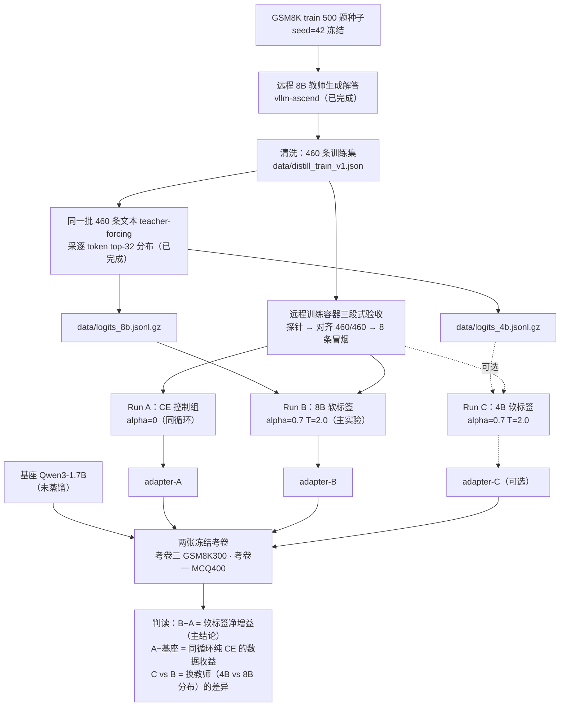

# C 层实验流程图：历史执行前计划（截至 2026-09-29）

> 这份图记录的是实验开始前的计划快照，不是当前待办清单。最终已执行的实验地图、文件血缘和结果以根目录 [项目总览.md](../项目总览.md) 为准；执行流水见 [实验记录.md](实验记录.md)。
>
> 结论先行：原计划主体是**一组软标签对照**——同一个自定义训练循环下，CE 控制组（alpha=0）对 8B top-32 软标签组（alpha=0.7, T=2.0）；两组之差就是软标签的**净增益**。后来实际又完成了停尾监督第二轮、原始 4B 直教和串行工程版级联，旧图不包含这些后续实验。

## 1. 流程图



纯文本版（终端里看这份）：

```text
【已有原料·不用重跑】
  GSM8K 500 种子 ──8B 教师(远程)──> 460 条解答 distill_train_v1.json
                                        │
                            同一批文本 teacher-forcing
                                        │
                 ┌──────────────────────┴──────────────────────┐
                 ▼                                             ▼
        logits_8b.jsonl.gz (top-32)                  logits_4b.jsonl.gz (top-32)

【远程 910B 训练容器·本轮执行】
  探针 → 对齐检查(460/460) → 8 条冒烟
        │
        ├── Run A  CE 控制组    --alpha 0              ──> adapter-A
        ├── Run B  8B 软标签    --alpha 0.7 --temp 2.0 ──> adapter-B   ← 主实验
        └── Run C  4B 软标签    --alpha 0.7 --temp 2.0 ──> adapter-C   ← 可选

【评测·同一张 NPU / 同一脚本 / 同一冻结协议】
  被评模型：基座 · 基座+adapter-A · 基座+adapter-B（· 基座+adapter-C）
  两张卷：考卷二 GSM8K test 300（数学域）· 考卷一 CMMLU+MMLU 400（通用域）

【判读】
  B − A        = 软标签净增益（主结论）
  A − 基座      = 同一循环纯 CE 的数据收益
  C 对比 B      = 换教师（原始 4B vs 8B 分布）的差异
  历史 Windows v1/v2 = 背景，不做严格单变量比较
```

## 2. 哪些要重做、哪些不用（Windows → 服务器）

| 项目 | 原来在哪做 | 服务器上要重做吗 | 原因 |
|---|---|---|---|
| 种子采样、清洗、训练集构造 | 本地 + 远程 | 不用 | 脚本确定性，输入相同输出相同 |
| 8B/4B logits 采集 | 远程 vLLM（已完成） | 不用 | 本轮直接用现成文件，不再采 |
| B 层 SFT v1/v2 | Windows WSL2 + LLaMA-Factory | 不重训 | 只作背景；训练器与 C 层不同 |
| **前测基线：未蒸馏 1.7B 两张卷** | Windows CUDA | **要重测（不重训）** | 后测在 NPU 上跑，前后测必须同设备同脚本，否则设备差异混进结论 |
| CE 控制组（Run A） | — | 不是「重做」，是新增对照 | 旧 v1 是 LLaMA-Factory 训的，不能当同循环对照 |

一句话：**要补的只有 NPU 上的未蒸馏基线（两张卷，只测不训）**；其余历史结果不重跑，只作背景。基线同时还是一次协议可移植性检查——它应该和历史数字大致吻合。

## 3. 本轮清单（历史计划，已被后续执行记录替代）

> 下列数量是 2026-09-29 计划时的估计，不是最终完成数量。最终实际为主对照两轮五组十场，另加级联/教师容量对照四场。

- 训练：2 组（Run A/B）+ 1 组可选（Run C）
- 评测：3 个模型 × 2 张卷 = 6 场（含可选 C 则 8 场）
- 产出：adapter-A/B(/C) + 对应评测 JSON（含逐题记录）+ 训练日志

## 4. 不在本轮流程里的遗留项（历史计划；后续已部分完成）

- A 线遗留：4B-think 的通用卷（MCQ400）后来已完成，结果为 `0.6325`；逐题 JSON 目前在远端功能分支 `e1ed686`，尚未合入 `main`。
- 真正级联：严格的独立传递集版本仍未做；项目后来完成的是同一批 460 条上的串行工程版级联，详见 [项目总览.md](../项目总览.md)。
